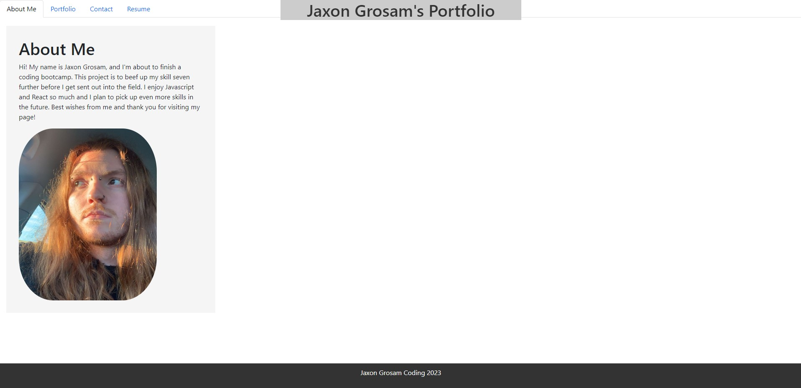

# React-Portfolio

## Description

Creating a portfolio using our new skills in React is an invaluable asset to my future career in the field. 
Using all the techniques we learned in class, and then doing my own research was great practice for the future. 
This portfolio is clearly not polished/finished or at a final product, but I'm confident that I can get it there. 
It was great to look back over my past projects and reflect on the things I could improve on as well.

## Table of Contents (Optional)

N/A

## Installation

N/A

## Usage

Screenshot

## Credits

Class work and online docs for ways to implement things I didn't know how to
